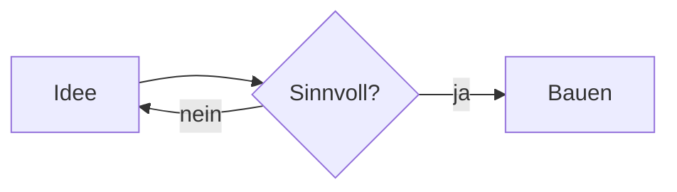

# blog.ecke.lt

Persönlicher Blog von Nils Eckelt — gebaut mit [Astro](https://astro.build),
gehostet auf **Cloudflare Pages**. Teilt sich die Designsprache mit
[nils.ecke.lt](https://nils.ecke.lt) (Profil) und
[book.ecke.lt](https://book.ecke.lt) (Buchung).

## Entwicklung

```bash
npm install
npm run dev      # http://localhost:4321
npm run build    # statischer Output nach ./dist
npm run preview  # gebauten Output lokal ansehen
```

Node 22 (siehe `.nvmrc`).

## Einen Beitrag schreiben

Neue Markdown-Datei unter `src/content/blog/` anlegen, z. B.
`src/content/blog/2026-07-15-mein-thema.md`:

```markdown
---
title: "Titel des Beitrags"
description: "Ein bis zwei Sätze für Übersicht, OG-Tags und RSS."
pubDate: 2026-07-15
# updatedDate: 2026-07-20   # optional
tags: ["Cloud", "Agentic"]   # optional
draft: false                 # true = wird nicht veröffentlicht
---

Inhalt als Markdown …
```

Der Dateiname (ohne `.md`) wird zur URL: `/blog/2026-07-15-mein-thema/`.
Übersicht, Beitragsseite, Sitemap und RSS-Feed (`/rss.xml`) entstehen
automatisch.

### Mermaid-Diagramme

Ein Code-Block mit Sprache `mermaid` wird automatisch als Diagramm gerendert:

````markdown

````

Das Rendering passiert **client-seitig** und liest die Design-Tokens live aus —
Diagramme nutzen also dieselben Farben/Schriften wie die Seite und schalten
automatisch zwischen Light/Dark um (siehe `src/scripts/mermaid.ts`). Mermaid
wird nur auf Seiten geladen, die tatsächlich ein Diagramm enthalten, und ist
damit auf Cloudflare Pages ohne Build-Browser lauffähig.

## Deployment (Cloudflare Pages)

Einmalig einrichten:

1. Cloudflare Dashboard → **Workers & Pages → Create → Pages → Connect to Git**
   → dieses Repo wählen.
2. Build-Einstellungen:
   - **Framework preset:** Astro
   - **Build command:** `npm run build`
   - **Build output directory:** `dist`
3. **Custom domain** `blog.ecke.lt` zuweisen — da die Zone `ecke.lt` bereits
   bei Cloudflare liegt (wie `book.ecke.lt`), wird der DNS-Record automatisch
   gesetzt, HTTPS inklusive.

Danach gilt: `git push` → Cloudflare baut und deployed automatisch.

## Design Library

Die gemeinsame Designsprache liegt **framework-frei** in
[`src/styles/tokens.css`](src/styles/tokens.css): alle CSS-Custom-Properties
(Farben für Light/Dark, Typo, Layout, Badge-Palette) plus die `@font-face`-
Deklarationen. Die beiden Fonts liegen in `public/fonts/`.

Das ist die **kanonische Quelle der Designsprache** für alle drei Seiten. Sie
ist bewusst portierbar gehalten:

- **Profil (statisches HTML auf Fastmail):** `tokens.css` einbinden bzw. die
  Variablen daraus übernehmen.
- **Booking (CSS-in-Worker):** denselben `:root`-Block verwenden.

> Bewusst **keine** publizierte npm-Package: Profil hat keinen Build-Schritt
> und Booking rendert CSS als String im Worker — eine Paket-Abhängigkeit dort
> einzuziehen wäre unverhältnismäßig. Sollten beide später einen Build-Schritt
> bekommen, lässt sich `tokens.css` + `public/fonts/` ohne Änderung in ein
> Paket `@eckelt/ui` heben, das alle drei konsumieren.

## Struktur

```
public/
  fonts/            geteilte woff2-Fonts (Bricolage Grotesque, DM Sans)
  favicon-32.png, apple-touch-icon.png, ne.svg
src/
  styles/
    tokens.css      ← Design Library (kanonisch, framework-frei)
    global.css      Basis-Elemente + Prose, baut auf tokens.css
  components/        BaseHead, Header, Footer, FormattedDate
  layouts/           BaseLayout, PostLayout
  content/blog/      die Beiträge (Markdown)
  pages/             index (Übersicht), blog/[...slug], rss.xml
  content.config.ts  Schema der Blog-Collection
  consts.ts          Site-Metadaten + Navigation
```
