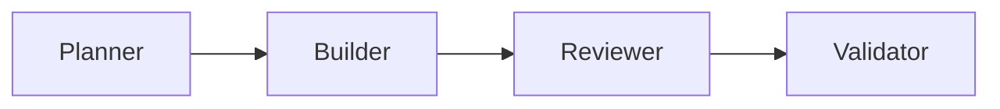

Across this series I keep saying "software factory" and then compressing it into a single line: PO, Dev, Code Review, QA — just as an agent workflow. That line is enough to follow the benchmarks, but it hides the part I find most interesting: how the roles actually behave, and why a couple of steps that look like overhead earn their place. So here's the long version, once, in a post I can link back to.

To me, a software factory is a setup of several specialized AI agents. Instead of one agent doing everything, multiple roles work together — much like a software development team. Each role runs in its own context window and owns one part of the work.

## The Planner

The Planner is essentially the PO of an agile team. It takes in the requirements — and this can be configured however you like. I feed mine in as a GitHub issue and let the Planner run a few rounds with me, asking clarifying questions until the requirement is actually solid. That roughly corresponds to refinement, and it's also where splitting can happen: a request that's too big gets broken into pieces that can each be built and checked on their own. At the end of this step, the specs to be implemented are set.

This is the part I think matters most and can measure least. A good spec is where most of the quality is decided — long before any code exists. It's also the piece I haven't yet figured out how to hold constant across a benchmark, which is a separate rabbit hole.

## The Builder

Once the specs are set, they go to the Builder. It implements them according to however this team develops in general — coding conventions, project structure, testing approach. TDD is just one example worth mentioning here; the point is that the Builder inherits the team's rules, not that it invents its own.

## The Reviewer

When the Builder thinks it's done, the Reviewer takes over. It checks whether the guardrails, architecture decisions and general guidelines were followed.

Why bother with this step at all — isn't it the same model checking its own work? That was my assumption too, and it's wrong. Even when the Builder and Reviewer use the same model, the Reviewer usually finds something the Builder glossed over or forgot on the first pass. Fresh context, a single job — "critique this against the rules" instead of "build this" — and things that were invisible while building become obvious while reviewing. This step adds a lot of quality for what it costs, and it's the clearest argument I have for splitting the work across roles at all.

## The Validator

Once the hopefully few review loops are cleared, the Validator comes in. It checks whether the implementation actually solves the problem — not whether it's clean, but whether it works.

The order here can vary from factory to factory. Some validate first whether it even runs before correcting style and structure. And, honestly — writing this out is what made me notice that this order makes more sense. First check that it works, then make it pretty. I'm going to change that in my own factory.

> Make it work, make it pretty, make it fast, make it work again, because you broke it while you made it fast.

## The human

And when the last agent is done, it goes back to the human, who does the final sign-off. The factory doesn't remove the human — it moves them to the end, where they approve a finished, reviewed, validated result instead of babysitting every step.

## Where this can go further

What I've described is a single pass: requirements in, working software out. The layer I'm most curious about next is making the factory improve _itself_ over time. Two directions I want to try:

**Retros.** After a run, an agent looks back at where the loops piled up — which specs were unclear, which class of mistake the Reviewer kept catching — and proposes updates to the conventions, guardrails or prompts. The factory's rules stop being static and start learning from its own history.

**Standing reviews of the setup.** Not the code review inside a run, but a periodic review of the factory itself: are the roles still cut the right way, is a step consistently adding nothing, has the underlying model shifted enough to rebalance the work between roles?

Both turn the factory from a fixed pipeline into something that gets a little better each cycle. I haven't built either properly yet — so, as usual, a note to future me.

That's the factory in broad strokes: PO, Dev, Code Review, QA, then a human gate. The finer details — how many review loops you allow, whether the Validator runs before or after cleanup, how much context each role carries — you add to taste and experience. Those knobs are exactly what I've been [benchmarking in the rest of this series](/blog/2026-06-30-software-factory-benchmark-1-en).
