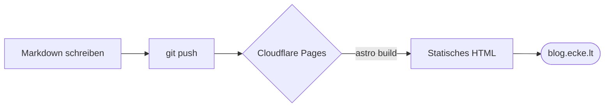

Ein Profil sagt, _wer_ ich bin. Ein Buchungslink sagt, _wann_ man mit mir
sprechen kann. Was bisher gefehlt hat, ist ein Ort für das _Wie_ und _Warum_ —
für die längeren Gedanken, die nicht auf eine Visitenkarte passen. Deshalb gibt
es jetzt diesen Blog.

## Worum es hier geht

Ich arbeite täglich an drei Themen, und genau darüber wird hier geschrieben:

- **Agentic Product Development** — wie Teams KI-Agenten produktiv und
  verantwortungsvoll in die Produktentwicklung einführen.
- **Engineering Transformation** — wie festgefahrene Modernisierungen wieder
  Fahrt aufnehmen, ohne den Betrieb auszubremsen.
- **Cloud** — wie Landschaften einfacher statt komplizierter werden.

Kein Marketing, sondern Erfahrungen aus 19 Jahren Praxis — inklusive der
Umwege.

## Wie diese Seite gebaut ist

Passend zum Thema ist auch der Blog selbst klein und wartungsarm:

- **[Astro](https://astro.build)** generiert statisches HTML — schnell, ohne
  Laufzeit-Overhead.
- **Cloudflare Pages** baut und hostet bei jedem `git push` automatisch.
- Das Design teilt sich eine gemeinsame `tokens.css` mit
  [nils.ecke.lt](https://nils.ecke.lt) und [book.ecke.lt](https://book.ecke.lt)
  — gleiche Fonts, gleiche Farben, ein Ort der Wahrheit.

Ein neuer Beitrag ist eine Markdown-Datei. Mehr Pipeline braucht es nicht:



Diagramme wie dieses sind direkt eingebaut: ein ` ```mermaid `-Block im Text
genügt. Sie übernehmen automatisch die Farben und Schriften der Seite — hell
wie dunkel.

Auf bald.
