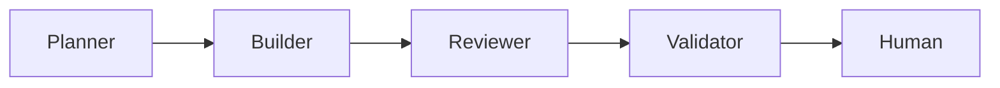

Across this series I keep saying _"software factory"_ and then compressing it into a single line: PO, Dev, Code Review, QA — just as an agent workflow. That line is enough to follow the benchmarks, but it hides the part I find most interesting: how the roles actually behave, and why a couple of steps that look like overhead earn their place. So here's the long version, once, in a post I can link back to — and revisit from time to time, as I gain new insights.

To me, a _software factory_ is a setup of several specialized AI agents. Instead of one agent doing everything, multiple roles work together — much like a software development team. Each role runs in their own context window and owns one part of the work.

## The Planner

The Planner is essentially the PO of an agile team. They take in the requirements — and this can be configured however you like. I feed mine in as a GitHub issue and let the Planner run one or two rounds with me, asking clarifying questions until the requirement is actually solid. That roughly corresponds to refinement, and it's also where splitting can happen: a request that's too big gets broken into pieces that can each be built and checked on their own. At the end of this step, the specs to be implemented are set. This is also where I try to establish a glossary — the _ubiquitous language_, in DDD terms.

This is the part I think matters most and can measure least. A good spec is where most of the quality is decided — long before any code exists. It's also the piece I haven't yet figured out how to hold constant across a benchmark, which is a separate rabbit hole. 

I'd strongly recommend using the best model available to you for this step. Coding itself can, in a pinch, be left to Sonnet or another non-top-tier model — but the spec deserves your best. 

## The Builder

Once the specs are set, they go to the Builder. They implement them according to whatever guardrails you set. I set the rules much like I used to brief my teams — except here there's no need to align a whole team on a shared understanding first. You're the boss; you set them, no discussion needed. Coding conventions, project structure, testing approach: TDD and BDD are just examples worth mentioning here. The point is that the Builder inherits these rules, not that they invent their own — you don't want them getting creative. You define the rules and hold the overall architecture in your head. You're the responsible engineer, after all. 

## The Reviewer

When the Builder claims their work is done, the Reviewer takes over. They check whether the guardrails, architecture decisions and general guidelines were followed.

Why a separate role — why not let the Builder check their own work? Because whoever builds something is biased toward thinking it's finished. We humans are, and, strangely enough, agents are too. And it doesn't even matter whether the Reviewer runs on the same model as the Builder: a fresh context and a single job — "critique this against the rules" instead of "build this" — makes things that were invisible while building obvious while reviewing. I don't have hard numbers, but seeing how often the Reviewer sends work back, having one is a no-brainer. This step adds a lot of quality for what it costs, and it's the clearest argument I have for splitting the work across roles at all.

## The Validator

Once the hopefully few review loops are cleared, the Validator comes in. They check whether the implementation actually solves the problem — not whether it's clean, but whether it works.

The order here can vary from factory to factory. Some validate first whether it even runs before correcting style and structure. And, honestly — writing this out is what made me notice that this order makes more sense. First check that it works, then make it pretty. I'm going to change that in my own factory.

> Make it work, make it pretty, make it fast, make it work again, because you broke it while you made it fast.

## The Human

And when the last agent is done, it goes back to the human, who does the final sign-off. The factory doesn't remove the human — it moves them to the end, where they approve a finished, reviewed, validated result instead of babysitting every step.

Also, if anything in the implementation loop went other than perfectly, we flag it for a retro — more on that just below.

## Where this can go further

What I've described is a single pass: requirements in, working software out. From here I keep collecting ideas to improve the factory — and the ones I find most exciting are those that improve it _automagically_, without me in the loop. A few I want to try, not all of them are self-improving:

**Orchestrator.** Instead of each agent handing their work down the line like a game of telephone, an overseeing orchestrator could give each agent exactly their piece — matched to their skill set and their context window. That would also fix the problem I hit with the Agile Factory in the benchmark.

**Retros.** After a run, an agent looks back at where the loops piled up — which specs were unclear, which class of mistake the Reviewer kept catching — and proposes updates to the conventions, guardrails or prompts. The factory's rules stop being static and start learning from its own history. Especially the issues the human flagged at sign-off: those are best worked through together, and each one is a chance to harden the factory against the same mistake next time.

**Standing reviews of the setup.** Not the code review inside a run, but a periodic review of the factory itself: are the roles still cut the right way, is a step consistently adding nothing, has the underlying model shifted enough to rebalance the work between roles? 

**Architectural Review.** After a while, some of the ADRs deserve re-validation, and the code deserves a revisit — checked for how maintainable it still is. In human teams we always wish we had time for that; in agentic teams we can actually plan for it, and it will happen. Regularly. The future we live in.

Most of these turn the factory from a fixed pipeline into something that gets a little better each cycle. I haven't built them properly yet — so, as usual, a note to future me.

That's the factory in broad strokes: PO, Dev, Code Review, QA, then a human gate. The finer details — how many review loops you allow, whether the Validator runs before or after cleanup, how much context each role carries — you add to taste and experience. Those knobs are exactly what I've been [benchmarking in the rest of this series](/blog/2026-06-30-software-factory-benchmark-1-en).
